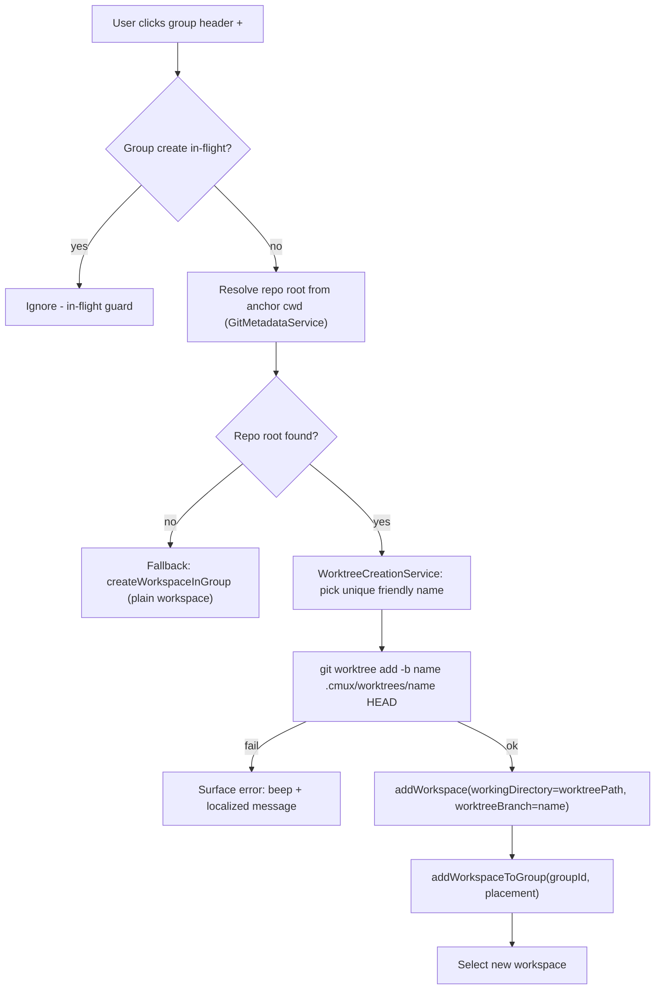
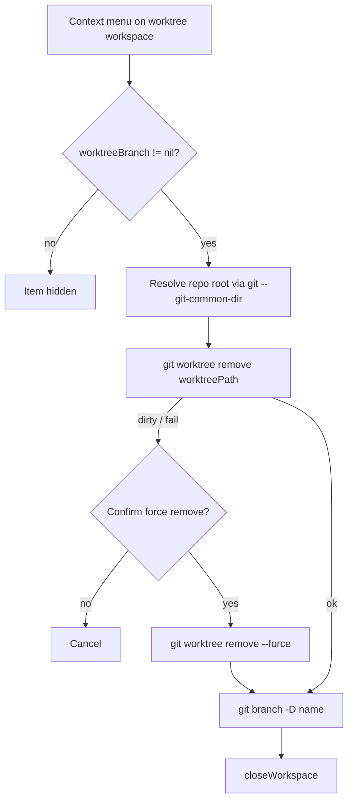

# feat: Create a git worktree from a repo-backed Workspace Group's "+" button

## Summary

Conductor's "+" next to a repo creates a new git worktree and opens it as a workspace. cmux already has the **git plumbing** for this — `Sources/ExtensionWorktreePrototype.swift` runs `git worktree add -b <branch> <path> HEAD`, ignores `.cmux/` locally, and spawns a workspace in the worktree — but it is wired only into the **extension sidebar** (a provider surface most users never see) and is demo-grade (it writes throwaway sample HTML and runs a hardcoded `python3 -m http.server`).

This plan brings real worktree creation to the **main user-facing sidebar**. A Workspace Group becomes "repo-aware": when its header "+" is pressed and the group resolves to a git repo, cmux instantly creates an auto-named worktree off the repo's current `HEAD` and opens it as a member workspace. Non-repo groups keep today's plain-workspace behavior unchanged. A worktree workspace is marked (and the mark persists across restart) so it can offer a manual **Remove worktree** action; closing a worktree workspace leaves it on disk (v1). One shared worktree-creation primitive backs both the new group "+" and the existing extension-sidebar "+", and the throwaway demo decoration is removed from the user-facing path.

**Confirmed scope (user decisions):** repo-aware groups · instant, auto-named (no dialog) · leave-on-disk + manual remove · clean checkout (no file copy, no setup script).

---

## Problem Frame

- **Today:** The main sidebar group "+" (`Sources/SidebarWorkspaceGroupHeaderView.swift` → `Sources/VerticalTabsSidebar+WorkspaceGroups.swift:121` → `TabManager.createWorkspaceInGroup`) creates a **plain** workspace that shares/inherits a directory. There is no worktree creation a normal user can reach.
- **Prototype gap:** Worktree creation exists (`CmuxExtensionWorktreePrototype.createWorktree`) but is reachable only from `extensionSidebarSection` in `Sources/ContentView.swift:11988` (gated on `section.treeSection.projectRootPath`), and it is intentionally demo-grade.
- **Goal:** Make the worktree-per-workspace workflow first-class in the main sidebar with a clean, predictable v1, reusing the existing plumbing rather than reinventing it.

---

## Requirements

| ID | Requirement |
|----|-------------|
| R1 | A repo-backed Workspace Group's header "+" creates a new git worktree of that repo and opens it as a member workspace in the group. |
| R2 | Creation is instant and auto-named — no dialog. A friendly, git-ref-safe, unique branch name is created off the repo's current `HEAD`. |
| R3 | Non-repo groups keep today's plain-workspace "+" behavior (no regression). Resolution failure falls back silently to `createWorkspaceInGroup`. |
| R4 | Worktrees are created under `<repo>/.cmux/worktrees/<name>`, and `.cmux/` is kept locally git-ignored (idempotent). |
| R5 | A worktree workspace carries a persisted marker so it is identifiable after restart; closing it leaves the worktree on disk (v1). |
| R6 | A "Remove worktree" action deletes the worktree directory + its branch, prompting for confirmation (force) when the worktree has uncommitted changes. |
| R7 | One shared worktree-creation primitive backs both the new group "+" and the existing extension-sidebar "+". The throwaway demo (sample HTML + python server) is removed from the user-facing creation path. |
| R8 | All new user-facing strings are localized (en + ja); all new test files are wired into `cmux.xcodeproj/project.pbxproj`. |

---

## Key Technical Decisions

- **KTD1 — Repo-awareness is resolved on click, not persisted on the group (v1).** The group's repo = its anchor workspace's repo. On "+", resolve the repo root from the anchor workspace's `currentDirectory` using `CmuxGit.GitMetadataService` (reuses `GitMetadataService+RepositoryResolution`), not raw shell math. This avoids touching `WorkspaceGroup` and `SessionWorkspaceGroupSnapshot`, keeping model churn minimal. Persisting `repoRootPath` on the group (deterministic binding + repo badge) is deferred.
- **KTD2 — Extract a clean `WorktreeCreationService`; the prototype delegates to it.** The git-worktree-add work moves into a focused service (ensure repo, ensure `.cmux/` ignored, pick a unique friendly name, `git worktree add -b <name> .cmux/worktrees/<name> HEAD`, return `{ worktreePath, branchName }`). `CmuxExtensionWorktreePrototype` keeps its demo decoration but calls the shared service for the git work, satisfying the shared-behavior policy (one git-worktree path, two entrypoints).
- **KTD3 — Reuse existing public creation primitives for grouping.** The new shared action calls `TabManager.addWorkspace(workingDirectory: worktreePath, …)` then `addWorkspaceToGroup(workspaceId:groupId:placement:)`, rather than widening the `CmuxWorkspaces` coordinator's `createWorkspaceInGroup` factory signature. Lower blast radius; reuses tested methods. (Alternative — threading `workingDirectory` through the coordinator — is cleaner long-term but touches a package boundary; deferred.)
- **KTD4 — Worktree identity via a lightweight persisted field on Workspace.** Add `worktreeBranch: String?` to `Workspace` and `SessionWorkspaceSnapshot` (nil = not a worktree). This gates the "Remove worktree" menu item and survives restart. No git probing per render.
- **KTD5 — Auto-name from a curated friendly wordlist.** Branch + workspace title share one git-ref-safe name (Conductor-style codename, e.g. a city list), de-duplicated against existing branches with a numeric suffix on collision. Exact wordlist deferred to implementation.
- **KTD6 — Base is current `HEAD` (v1).** Matches "instant, auto-named." Choosing a base branch (e.g. `origin/main`) was the rejected dialog option and is deferred.
- **KTD7 — Sidebar snapshot-boundary compliance.** The worktree marker reaches sidebar rows only as part of their immutable value snapshot, and "Remove worktree" is delivered via the existing closure-action bundle pattern (`IndexSectionActions`-style). No `ObservableObject`/store reference is introduced below any `LazyVStack`/`ForEach` boundary (see cmux issue #2586 family).

---

## High-Level Technical Design

**Create flow (group "+"):**

**Remove flow (context menu):**

These are authoritative design, not implementation specs — exact method signatures are the implementer's call.

---

## Scope Boundaries

**In scope (v1):** repo-aware group "+", instant auto-named worktree creation off HEAD, silent fallback for non-repo groups, persisted worktree marker, manual "Remove worktree" with dirty confirmation, shared worktree-creation primitive, removal of demo decoration from the user-facing path, localization + test wiring.

### Deferred to Follow-Up Work
- Persisting `repoRootPath` on `WorkspaceGroup` (deterministic repo binding + repo badge in the header).
- A create dialog for naming the branch and choosing a base branch (e.g. `origin/main`).
- Lifecycle automation on close (auto-remove or ask-on-close) — v1 is leave-on-disk + manual remove.
- Copying untracked/ignored files (e.g. `.env`) and per-project setup scripts (Conductor parity).
- A keyboard shortcut for "New worktree" (would require `KeyboardShortcutSettings` + Settings UI + `cmux.json` + docs per shortcut policy).
- Migrating the extension-sidebar prototype's *demo* (sample dev server) onto a real setup-script mechanism.

---

## Implementation Units

### U1. Clean `WorktreeCreationService`
**Goal:** A focused, production worktree-creation primitive with no demo decoration.
**Requirements:** R2, R4, R7.
**Dependencies:** none.
**Files:**
- `Sources/WorktreeCreationService.swift` (new) — `createWorktree(repoRoot:) async throws -> WorktreeCreationResult { worktreePath, branchName }`.
- `cmuxTests/WorktreeCreationServiceTests.swift` (new; wire into pbxproj — R8).
**Approach:** Lift the reliable helpers from `Sources/ExtensionWorktreePrototype.swift` — `ensureGitRepository`, `ensureCmuxWorktreeDirectoryIsLocallyIgnored`, the `Process`/`Pipe` runner — into the service. Create the branch off `HEAD`, place the worktree at `<repoRoot>/.cmux/worktrees/<name>`. Implement friendly unique naming (KTD5): pick a wordlist name not colliding with an existing branch (`git branch --list`/`git show-ref`), append `-2`, `-3`… on collision; ensure git-ref-safe. **Do not** write sample files or a setup command. Run off the main thread (`Task.detached`, mirroring the prototype).
**Patterns to follow:** `Sources/ExtensionWorktreePrototype.swift` (process runner, exclude handling); `Packages/CmuxGit/.../GitMetadataService+RepositoryResolution.swift` for repo-root resolution helpers.
**Execution note:** Test-first — drive the service from `WorktreeCreationServiceTests` against a temp git repo fixture.
**Test scenarios:**
- Happy path: given a temp repo with ≥1 commit, returns a worktree under `.cmux/worktrees/<name>` that `git worktree list` reports; branch exists off HEAD.
- `.cmux/` is added to `info/exclude` exactly once across two consecutive creations (idempotent).
- Name collision: two creations in the same repo yield distinct, git-ref-safe branch names.
- Error: non-repo path throws a typed error (no partial worktree left behind).
- Error: repo with **unborn/detached HEAD** (no commit) throws rather than creating a broken worktree.

### U2. Refactor `ExtensionWorktreePrototype` to delegate to the shared service
**Goal:** Single git-worktree-add path across both entrypoints (shared-behavior policy).
**Requirements:** R7.
**Dependencies:** U1.
**Files:**
- `Sources/ExtensionWorktreePrototype.swift` (modify) — call `WorktreeCreationService` for the git work; keep demo-file writing + sample setup command as prototype-only decoration layered on the result.
- `cmuxTests/ExtensionWorktreeSpawnArgsTests.swift` (modify if signatures shift).
**Approach:** The prototype's `createWorktree` becomes a thin wrapper: shared service produces `{ worktreePath, branchName }`; the prototype then writes its sample dev-server files and builds the `setupCommand`. `workspaceSpawnArgs()` is unchanged.
**Patterns to follow:** existing prototype structure; `CmuxExtensionWorktreeWorkspaceSpawnArgs`.
**Test scenarios:**
- Prototype result still yields `workspaceSpawnArgs()` with `initialTerminalInput` ending in `\n` and `inheritWorkingDirectory == false` (regression guard on existing behavior).
- The worktree path returned by the prototype matches what the shared service created (delegation wired correctly).

### U3. Persisted worktree marker on Workspace
**Goal:** A worktree workspace is identifiable and survives restart.
**Requirements:** R5.
**Dependencies:** none.
**Files:**
- `Sources/Workspace.swift` (modify) — add `worktreeBranch: String?` (default nil); thread through the relevant initializer(s).
- `Sources/SessionPersistence.swift` (modify) — add `worktreeBranch: String? = nil` to `SessionWorkspaceSnapshot`; capture in `sessionSnapshot()`, restore in `restoreSessionSnapshot()`.
- `cmuxTests/WorkspaceUnitTests.swift` and/or a session-persistence test (modify/new; wire if new).
**Approach:** Minimal additive field. Default-nil keeps older snapshots decoding cleanly (Codable optional with default). No behavior beyond carrying identity.
**Test scenarios:**
- A workspace created with `worktreeBranch = "x"` round-trips through snapshot save → restore with the marker intact.
- An older snapshot JSON without the field decodes with `worktreeBranch == nil` (back-compat).
- A plain workspace has `worktreeBranch == nil`.

### U4. Shared "create worktree workspace in group" action + group "+" wiring
**Goal:** The main sidebar group "+" creates a worktree for repo-backed groups; falls back to plain for others.
**Requirements:** R1, R2, R3.
**Dependencies:** U1, U3.
**Files:**
- `Sources/TabManager.swift` (new method) — `createWorktreeWorkspaceInGroup(groupId:)`: resolve anchor cwd → repo root (GitMetadataService); if found, `WorktreeCreationService.createWorktree` → `addWorkspace(workingDirectory: worktreePath, worktreeBranch: name, select: true, eagerLoadTerminal: false)` → `addWorkspaceToGroup(workspaceId:groupId:placement:)`; else `createWorkspaceInGroup(...)` (fallback). Per-group in-flight guard.
- `Sources/VerticalTabsSidebar+WorkspaceGroups.swift` (modify) — point `onTapPlus` (line 121) at the new action.
- `Sources/SidebarWorkspaceGroupHeaderView.swift` (modify) — optional: swap "+" → progress glyph while in-flight (mirror `extensionSidebarWorktreeCreationInFlightSectionIds`); add a localized "New worktree" tooltip for repo-backed groups.
- `cmuxTests/WorkspaceGroupWorktreeCreationTests.swift` (new; wire into pbxproj — R8).
**Approach:** One shared mutation path for the group entrypoint (KTD3). Failure surfaces as beep + localized message + debug log; no half-created workspace. In-flight guard prevents double-create on rapid clicks.
**Execution note:** Add behavior-level coverage for the routing decision (repo-backed vs. fallback) before wiring the UI — this is the exact repro surface for the feature.
**Test scenarios:**
- Repo-backed group: action invokes worktree creation and the resulting workspace lands in the group with `worktreeBranch` set and `currentDirectory` == worktree path.
- Non-repo group: action falls back to `createWorkspaceInGroup` and creates a plain workspace (no worktree, `worktreeBranch == nil`) — **no regression**.
- In-flight guard: a second "+" press while creation is in flight is ignored.
- Creation failure (service throws): no workspace is added; error path runs.

### U5. "Remove worktree" context-menu action
**Goal:** Manual removal of a worktree + branch, safe against uncommitted work.
**Requirements:** R5, R6.
**Dependencies:** U3.
**Files:**
- `Sources/ContentView.swift` (modify) — add a "Remove worktree" item to the workspace-row context menu, shown only when the row's snapshot has `worktreeBranch != nil` (KTD7: gating flows through the row value snapshot + closure action bundle, not a store reference).
- `Sources/TabManager.swift` (new method) — `removeWorktree(workspaceId:)`: resolve repo root from the workspace cwd via `git -C <cwd> rev-parse --git-common-dir` (use git output, not `URL.deletingLastPathComponent` — see Risks/macOS pitfall); `git -C <repoRoot> worktree remove <path>`; on dirty failure, confirm then `--force`; `git -C <repoRoot> branch -D <branch>`; then `closeWorkspace`.
- `Resources/Localizable.xcstrings` (modify) — menu title, confirmation title/body, error messages (en + ja).
- `cmuxTests/WorktreeRemovalTests.swift` (new; wire into pbxproj — R8).
**Approach:** Removal runs from the main repo, never from inside the worktree being removed. Dirty worktrees require an explicit confirmation that states the worktree directory and its branch will be deleted (the branch `-D` may drop unmerged commits — say so in the copy).
**Test scenarios:**
- Menu gating: item present iff `worktreeBranch != nil`.
- Clean worktree: `worktree remove` + `branch -D` succeed, workspace closes.
- Dirty worktree: plain remove fails; confirming force removes it; declining cancels (worktree untouched).
- Repo-root resolution uses git output and is correct for a worktree under `.cmux/worktrees/`.

### U6. Localization audit + lightweight docs
**Goal:** Close out user-facing-string and discoverability obligations.
**Requirements:** R8.
**Dependencies:** U4, U5.
**Files:**
- `Resources/Localizable.xcstrings` (verify) — every new key has en + ja (tooltip, menu item, confirmation, errors). `defaultValue`/English copy does not count.
- `CHANGELOG.md` (modify) — one line noting worktree creation from the sidebar "+".
- `web/app/[locale]/docs/...` (modify only if a user-facing doc already documents sidebar group behavior; otherwise skip).
**Approach:** Enumerate every changed user-facing surface from U2/U4/U5, parse the xcstrings, and confirm each new key has both locales. State the audit result in handoff.
**Test scenarios:** Test expectation: none — localization/docs verification (no behavioral change).

---

## Risks & Dependencies

- **Behavior change for repo-backed groups.** Users who keep plain workspaces in a group that happens to sit in a repo will now get worktrees from "+". *Mitigation:* fallback only changes repo-backed groups; an opt-out setting is a deferred follow-up. Flag in the changelog line.
- **Worktree removal data loss (R6).** *Mitigation:* leave-on-disk default, dirty confirmation, removal runs from the main repo with explicit copy about branch deletion.
- **macOS path-normalization pitfall.** `URL(...).deletingLastPathComponent().path` differs across macOS 14/15 vs 26 (CLAUDE.md / issue #4529). *Mitigation:* derive repo root from git output (`--git-common-dir`, `--show-toplevel`), never from URL math.
- **Sidebar CPU / snapshot boundary (#2586 family).** Adding worktree state to rows must follow the immutable-snapshot + closure-action pattern (KTD7). *Mitigation:* mirror `IndexSectionActions`/`SectionGapActions`; no store below `LazyVStack`.
- **pbxproj test wiring.** New `cmuxTests/*.swift` files are silently ignored by Xcode/CI if not registered (`lint-pbxproj-test-wiring.sh`). *Mitigation:* wire each new test file; template off `cmuxTests/ExtensionWorktreeSpawnArgsTests.swift`.
- **Async creation + focus.** Creation is off-main; UI mutations (add/select workspace) must hop back to main, and socket/focus policy must be respected. *Mitigation:* follow the prototype's `Task { … }` + main-actor pattern.
- **Dependencies/prereqs:** `git` on PATH (already assumed app-wide); `CmuxGit.GitMetadataService` for repo resolution; existing `addWorkspace`/`addWorkspaceToGroup` primitives.

---

## Open Questions (planning-resolved or explicitly deferred)

- **Auto-name source** (city-name wordlist vs. adjective-noun) — deferred to implementation (KTD5); does not affect architecture.
- **Tooltip wording / whether "+" visually distinguishes repo-backed groups** — deferred to U4 implementation; default is a "New worktree" tooltip with the existing "+" glyph.
- **Branch deletion policy on remove** (always `-D` vs. keep branch) — resolved: delete branch with `-D` behind the same confirmation; keeping the branch is not a v1 option.

---

## Sources & Research

- Local code: `Sources/ExtensionWorktreePrototype.swift`, `Sources/ContentView.swift:11988` (extension sidebar "+"), `Sources/SidebarWorkspaceGroupHeaderView.swift:161`, `Sources/VerticalTabsSidebar+WorkspaceGroups.swift:121`, `Sources/TabManager.swift:1752` (`createWorkspaceInGroup`)/`:1768` (`addWorkspaceToGroup`)/`:1023` (`addWorkspace`), `Packages/CmuxWorkspaces/.../WorkspaceGroup.swift`, `Sources/SessionPersistence.swift:1842` (`SessionWorkspaceGroupSnapshot`), `Packages/CmuxGit/.../GitMetadataService+RepositoryResolution.swift`, `cmuxTests/ExtensionWorktreeSpawnArgsTests.swift`.
- cmux conventions: CLAUDE.md (shared-behavior policy, snapshot-boundary rule, localization audit, pbxproj test wiring, macOS path pitfall).
- Reference UX: Conductor.build (Projects = repos; "+" creates a worktree; city-name codenames). No external research run — local patterns are sufficient and none was requested.
