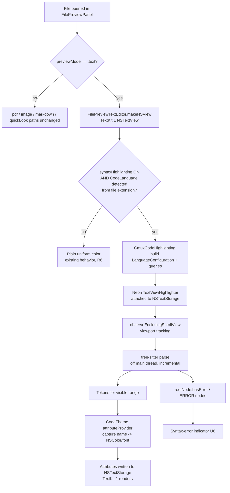
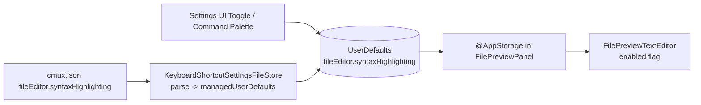

# feat: Tree-sitter syntax highlighting for the code-file preview

**Created:** 2026-06-24
**Type:** feat
**Depth:** Deep
**Status:** Ready for implementation

---

## Summary

cmux's file preview renders code files (`.py`, `.ts`, `.tsx`, `.js`, `.jsx`) as plain, uniform-colored text in a TextKit 1 `NSTextView`. This plan adds IDE-quality syntax highlighting using the ChimeHQ **Neon** + **SwiftTreeSitter** stack over tree-sitter grammars, so opened code files show colored keywords, strings, comments, functions, and types in a dark, readable theme — while staying fully editable and preserving the existing large-file (16 MB) responsiveness guarantees.

The work isolates the (pre-1.0, fast-moving) external dependencies behind a local `CmuxCodeHighlighting` package, mirrors the existing `fileEditor.wordWrap` setting end-to-end for a new `fileEditor.syntaxHighlighting` toggle, and adds a lightweight tree-sitter-derived syntax-error indicator. Full semantic ("undefined variable", type errors) IDE diagnostics require a Language Server and are explicitly deferred.

---

## Problem Frame

When a user opens a code file in cmux's preview, every character is painted one uniform foreground color (`Sources/Panels/FilePreviewTextEditor.swift:90`, `isRichText = false` at `:155`). Markdown is the only file type that renders richly, because it routes to a separate WKWebView path (`Sources/Panels/MarkdownPanel.swift`) bundling highlight.js. Code files route to `FilePreviewTextEditor`, which has no tokenizer, theme, or attribute application. The result is unreadable, IDE-unlike code review inside cmux.

The constraint that shapes the whole design: the preview's `NSTextView` is **deliberately** an explicit TextKit 1 stack (`NSTextStorage`/`NSLayoutManager`/`NSTextContainer`, `Sources/Panels/FilePreviewTextEditor.swift:124-167`) with `allowsNonContiguousLayout = true`. This was a hard-won fix for 100% CPU hangs while selecting in large files (cmux #4576, #5255; regression-guarded by `cmuxTests/FilePreviewTextEditorTextKitTests.swift`). Any highlighting approach must preserve TextKit 1 and must not move parsing onto the main thread.

---

## Requirements

- **R1 — Highlighting.** Opening a supported code file renders syntax highlighting that visually distinguishes at least keywords, strings, comments, numbers, functions, and types, in a dark, readable color theme.
- **R2 — Editable + live.** The file stays fully editable and savable; highlighting updates live as the user types (no read-only downgrade).
- **R3 — Performance preserved.** Highlighting must not regress large-file (up to 16 MB) open or selection responsiveness. Parsing runs off the main thread; styling is viewport-scoped; the TextKit 1 stack is preserved.
- **R4 — Supported languages.** Python (`.py`), TypeScript (`.ts`), TSX (`.tsx`), JavaScript (`.js`), JSX (`.jsx`) are highlighted. The language set is data-driven so more grammars can be added later.
- **R5 — Setting + parity.** A `fileEditor.syntaxHighlighting` boolean setting (default **on**) controls the feature. It is editable in Settings UI, settable in `~/.config/cmux/cmux.json`, toggleable via the command palette, and discoverable in settings search — all backed by **one shared key** (per shared-behavior policy).
- **R6 — No regression for other files.** Unsupported file types (and the feature disabled) render exactly as today (uniform plain text).
- **R7 — Localization.** Every new user-facing string is localized for EN + JA in `Resources/Localizable.xcstrings`; schema descriptions are localized in `web/messages/en.json` + `web/messages/ja.json`.
- **R8 — Syntax-error indicator (lightweight).** Syntactically broken code surfaces a basic indicator derived from tree-sitter `ERROR`/`MISSING` nodes. Semantic diagnostics (LSP) are out of scope (see Scope Boundaries).
- **R9 — Tests wired.** New package logic has unit tests; new `cmuxTests/` files are wired into `cmux.xcodeproj/project.pbxproj` (passes `scripts/lint-pbxproj-test-wiring.sh`).

---

## Key Technical Decisions

- **KTD1 — Neon + SwiftTreeSitter on TextKit 1.** Use ChimeHQ Neon's `TextViewHighlighter` driving SwiftTreeSitter. Neon's flicker-free, viewport-based highlighting is *designed for and recommended on TextKit 1* (its example app uses `usingTextLayoutManager: false` + `allowsNonContiguousLayout = true`); TextKit 2 highlighting is explicitly noted as unsolved. This aligns exactly with cmux's deliberate TextKit 1 choice — **we do not migrate to TextKit 2.** (Research: Neon README + example.)
- **KTD2 — Isolate dependencies behind a local `CmuxCodeHighlighting` package, pinned by commit.** Neon (last tag v0.6.0, README pins `branch: main`), SwiftTreeSitter (~0.8–0.10), and the grammars are all pre-1.0. Wrapping them in one local package with **commit-pinned** dependencies keeps API churn out of the app target, gives a clean cmux-facing API, and makes language detection + theme logic unit-testable without a text view. Note the known **Xcode 26 / SwiftPM C-module regression (tree-sitter #5523)** — validate the build on day one and pin known-good versions.
- **KTD3 — Mirror `fileEditor.wordWrap` end-to-end.** The existing word-wrap setting already threads a `fileEditor.*` boolean through catalog → schema → settings UI → command palette → settings search → cmux.json parser/template → `FilePreviewPanel` → `FilePreviewTextEditor`. Clone that exact path for `fileEditor.syntaxHighlighting`. This satisfies the shortcut/settings policy and shared-behavior policy by construction.
- **KTD4 — Grammars via official SPM packages; queries auto-loaded.** `tree-sitter-python`, `tree-sitter-typescript` (provides both `typescript` and `tsx` targets), `tree-sitter-javascript` (covers JS + JSX) all ship `Package.swift` with bundled `queries/`. `LanguageConfiguration` auto-resolves the highlight queries from the SPM bundle. Pin by commit (some grammar manifests use `.unsafeFlags`, which forbids version-range deps). Verify TS/TSX query inheritance from JS on a real `.tsx` file early.
- **KTD5 — Default ON; single built-in dark theme.** The user wants highlighting by default. Ship one dark, high-readability theme (a `TokenAttributeProvider` mapping capture names → `NSColor`/font). A user-selectable theme picker is deferred.
- **KTD6 — Diagnostics scope = tree-sitter syntax errors only.** Surface `ERROR`/`MISSING` nodes (cheap `rootNode.hasError` + range walk). Real "this code is broken" semantic analysis (type errors, undefined symbols) needs a Language Server — deferred as a separate feature.

---

## High-Level Technical Design

Data flow when a supported file opens with highlighting enabled:

Settings flow (mirrors `fileEditor.wordWrap`):

---

## Implementation Units

### U1. Add and pin the tree-sitter + Neon dependencies behind a local `CmuxCodeHighlighting` package

**Goal:** Establish a buildable dependency boundary for the external syntax-highlighting stack, isolated from the app target and pinned to known-good commits.

**Requirements:** R4 (enabling), R3 (TextKit 1 / large-file capable engine)

**Dependencies:** none

**Files:**
- `Packages/CmuxCodeHighlighting/Package.swift` (new) — declares dependencies on Neon, SwiftTreeSitter (+ `SwiftTreeSitterLayer` if injected languages are needed), `tree-sitter-python`, `tree-sitter-typescript`, `tree-sitter-javascript`, pinned by exact commit/tag.
- `Packages/CmuxCodeHighlighting/Sources/CmuxCodeHighlighting/CmuxCodeHighlighting.swift` (new) — package umbrella / smoke entry.
- `cmux.xcodeproj/project.pbxproj` — add the local package product as a dependency of the `cmux` app target, plus any `XCRemoteSwiftPackageReference` entries Xcode requires to resolve the transitive packages. Mirror how `swift-markdown-ui` / `Sparkle` remote references are declared (`cmux.xcodeproj/project.pbxproj:4638-4671`).

**Approach:** Follow the existing local-package convention (`Packages/CmuxSettings`, `Packages/CmuxSettingsUI`). The package targets macOS only and may import AppKit. Keep external dependency churn behind this boundary so the app target never imports Neon/SwiftTreeSitter directly. Resolve the `tree-sitter/swift-tree-sitter` vs legacy `ChimeHQ/SwiftTreeSitter` URL at integration time.

**Patterns to follow:** `Packages/CmuxSettings/` package layout; `XCRemoteSwiftPackageReference` block in `cmux.xcodeproj/project.pbxproj`.

**Execution note:** Validate two known sharp edges **before** building anything on top: (1) the Xcode 26 / SwiftPM C-module regression (tree-sitter #5523) against the local toolchain — apply the amalgamation workaround or pin a known-good version if it bites; (2) that `LanguageConfiguration` actually resolves and loads `highlights.scm` from each grammar's SPM resource bundle at runtime (the `bundleName:` resolution is a common "queries not found" failure). The pbxproj is auto-normalized by `scripts/normalize-pbxproj.py` on commit — expect reformatting.

**Test scenarios:**
- Package smoke test: the package builds and `import Neon` / `import SwiftTreeSitter` / each `TreeSitter*` grammar module resolves.
- Each grammar's `LanguageConfiguration` constructs without throwing and exposes a non-empty highlights query (Python, TypeScript, TSX, JavaScript). *Covers the query-bundle-loading risk.*
- `Test expectation:` integration-level (loads real bundles); place in the package's `Tests/` target.

**Verification:** `xcodebuild ... -derivedDataPath /tmp/cmux-<tag> build` succeeds with the package linked; a throwaway snippet parses a Python string and prints a node count.

---

### U2. Language detection, theme, and highlighter configuration (package core)

**Goal:** Provide the cmux-facing, unit-testable API: detect a `CodeLanguage` from a file, supply a dark readable theme, and build a Neon `TextViewHighlighter.Configuration`.

**Requirements:** R1, R4, R5 (theme readability)

**Dependencies:** U1

**Files:**
- `Packages/CmuxCodeHighlighting/Sources/CmuxCodeHighlighting/CodeLanguage.swift` (new) — `enum CodeLanguage { case python, typescript, tsx, javascript, jsx }`; `static func detect(fileExtension:) -> CodeLanguage?` and/or `detect(path:)`.
- `Packages/CmuxCodeHighlighting/Sources/CmuxCodeHighlighting/CodeTheme.swift` (new) — a dark theme as a `TokenAttributeProvider`; maps capture names (`keyword`, `keyword.*`, `string`, `comment`, `number`, `function`, `type`, `variable`, `property`, `operator`, `punctuation`, …) to `[NSAttributedString.Key: Any]` with `hasPrefix` matching and a readable default fallback color.
- `Packages/CmuxCodeHighlighting/Sources/CmuxCodeHighlighting/CodeHighlighterFactory.swift` (new) — builds the per-language `LanguageConfiguration` (cached) and the `TextViewHighlighter.Configuration` from a `CodeLanguage` + base font + theme.
- `Packages/CmuxCodeHighlighting/Tests/CmuxCodeHighlightingTests/CodeLanguageTests.swift` (new)
- `Packages/CmuxCodeHighlighting/Tests/CmuxCodeHighlightingTests/CodeThemeTests.swift` (new)

**Approach:** Keep `CodeLanguage` and `CodeTheme` free of any `NSTextView` reference so they're pure and testable. The theme should pass a contrast/readability bar against the cmux dark background; expose the colors as named constants. The factory owns the `LanguageConfiguration` cache (build once per language). JSX maps to the JavaScript grammar; TSX to the dedicated `tsx` target.

**Patterns to follow:** `Packages/CmuxSettings` pure-model + tests layout; theme color naming akin to `PanelAppearance`.

**Test scenarios:**
- `detect`: `py → .python`, `ts → .typescript`, `tsx → .tsx`, `js → .javascript`, `jsx → .jsx`, uppercase extension normalized, unknown (`md`, `png`, no extension) → `nil`. *Covers R4 + R6 routing.*
- Theme returns non-nil attributes with distinct foreground colors for `keyword`, `string`, `comment`, `function`, `type`, `number`; a dotted capture (`keyword.return`) resolves via prefix to the `keyword` style; an unknown capture falls through to the readable default (never the background color).
- Factory returns a valid `Configuration` for each `CodeLanguage` and reuses a cached `LanguageConfiguration` on repeated calls.

**Verification:** Package tests pass; visual spot-check deferred to U4.

---

### U3. Add the `fileEditor.syntaxHighlighting` setting (key, schema, cmux.json plumbing)

**Goal:** Introduce the shared setting key (default on) and wire it through the settings model, JSON schema, cmux.json parser, and template — the non-UI half of the wordWrap mirror.

**Requirements:** R5

**Dependencies:** none (can run parallel to U1/U2)

**Files:**
- `Packages/CmuxSettings/Sources/CmuxSettings/Keys/FileEditorCatalogSection.swift` — add `DefaultsKey<Bool>` `id/userDefaultsKey: "fileEditor.syntaxHighlighting"`, `defaultValue: true` (sibling of `wordWrap` at `:16-20`).
- `Sources/Panels/FilePreviewSyntaxHighlightingSettings.swift` (new) — lightweight wrapper mirroring `Sources/Panels/FilePreviewWordWrapSettings.swift` (`key`, `defaultEnabled = true`, `isEnabled(defaults:)`).
- `web/data/cmux.schema.json` — add `syntaxHighlighting` boolean under the `fileEditor` object (sibling of `wordWrap` at `:1110-1115`) with `descriptionKey`.
- `Sources/KeyboardShortcutSettingsFileStore.swift` — parse `section["syntaxHighlighting"]` into `managedUserDefaults` (mirror `:684-687`).
- `Sources/KeyboardShortcutSettingsFileStore+Template.swift` — add the key to the generated cmux.json template (mirror `:210-211`).

**Approach:** Default **true** so highlighting is on out of the box. Keep one canonical key string; `FilePreviewSyntaxHighlightingSettings.key` is the single source of truth referenced by the panel and the parser.

**Patterns to follow:** `fileEditor.wordWrap` across `FileEditorCatalogSection.swift`, `FilePreviewWordWrapSettings.swift`, `KeyboardShortcutSettingsFileStore.swift`.

**Test scenarios:**
- Settings file store: a cmux.json with `fileEditor.syntaxHighlighting = false` produces a `managedUserDefaults` entry of `false`; `true` produces `true`; an invalid (non-bool) value logs invalid and does not crash. *Mirror existing wordWrap parser tests if present.*
- Default resolution: with no key set, `FilePreviewSyntaxHighlightingSettings.isEnabled` returns `true`.

**Verification:** Settings-store unit tests pass; generated template contains the new key.

---

### U4. Attach the highlighter in `FilePreviewTextEditor` (integration seam)

**Goal:** When highlighting is enabled and the file's language is supported, attach Neon's `TextViewHighlighter` to the existing TextKit 1 text view; tear it down cleanly when disabled or unsupported, with editing/saving and large-file performance intact.

**Requirements:** R1, R2, R3, R6

**Dependencies:** U2, U3

**Files:**
- `Sources/Panels/FilePreviewTextEditor.swift` — add `syntaxHighlightingEnabled: Bool` and `codeLanguage: CodeLanguage?` (or the file path) inputs; in `makeNSView`/`updateNSView`, attach/detach the highlighter; new helper (e.g. `applySyntaxHighlighting(...)`) alongside `applyFilePreviewWordWrap`. Store the highlighter on the `Coordinator` so it persists and can be torn down.
- `Sources/Panels/FilePreviewPanel.swift` — add `@AppStorage(FilePreviewSyntaxHighlightingSettings.key)` (mirror `:1287`); resolve `CodeLanguage` from the panel's file extension; pass both into `FilePreviewTextEditor` (mirror the `wordWrap:` argument at `:1359`).

**Approach:** Build the highlighter from `CodeHighlighterFactory` (U2). Set the text view's `typingAttributes` to the monospace base font + theme foreground so untokenized text and the caret stay readable. Call `observeEnclosingScrollView()` after the view is inside its `NSScrollView` so styling is viewport-scoped. Keep `isRichText = false`. On toggle-off / unsupported language / language change, detach the highlighter and restore the uniform-color `applyTheme` path so R6 holds exactly.

**Key risk to verify (callout):** Neon installs itself as the **`NSTextStorage` delegate**, while the existing `Coordinator` is the **`NSTextView` delegate** (`textDidChange` → `updateTextContent`). These are different delegate slots and should coexist, but the save path depends on `textDidChange` still firing — this must be tested, not assumed.

**Patterns to follow:** `applyFilePreviewWordWrap(_:scrollView:)` lifecycle (idempotent, called from both `makeNSView` and `updateNSView`); `Coordinator` ownership in `FilePreviewTextEditor`.

**Execution note:** Build incrementally — attach on a single hardcoded `.py` file first, confirm colors render, then wire the real enabled-flag + language detection.

**Test scenarios:**
- Enabling highlighting on a `.py` panel results in non-uniform foreground colors across the storage (more than one distinct foreground color attribute present). *Covers R1.*
- Editing the document still invokes `updateTextContent` (save path), i.e. the `NSTextViewDelegate.textDidChange` callback fires while the highlighter is attached. *Covers R2 + the delegate-coexistence risk.*
- Toggling the setting off restores a single uniform foreground color (no residual token attributes). *Covers R6.*
- Opening an unsupported type (`.txt`, `.md` already routes elsewhere) or with the setting off attaches no highlighter. *Covers R6.*
- Selection/large-file: opening a multi-hundred-thousand-line file does not block the main thread on open (verification-level; assert highlighter uses viewport observation rather than full-document synchronous styling).

**Verification:** Tagged debug build (`./scripts/reload.sh --tag treesitter-highlight`); open a real `.py`, `.tsx`, `.ts`, `.js`, `.jsx` and confirm IDE-like colors, live edits, and save; open a 10k+-line file and confirm no hang on open/scroll/select.

---

### U5. Settings UI, command palette, search discoverability, and localization

**Goal:** Expose the toggle across every settings entrypoint and localize all new strings — the UI half of the wordWrap mirror, satisfying the settings/shortcut and localization policies.

**Requirements:** R5, R7

**Dependencies:** U3

**Files:**
- `Packages/CmuxSettingsUI/Sources/CmuxSettingsUI/Sections/AppSection.swift` — `@State DefaultsValueModel` init (mirror `:89`) + a `SettingsCardRow` + `Toggle` with `configurationReview: .json("fileEditor.syntaxHighlighting")` and an accessibility identifier (mirror `:426-436`).
- `Sources/SettingsNavigation.swift` — add a `setting(.app, "file-editor-syntax-highlighting", …)` entry (mirror `:331`).
- `Sources/SettingsSearchAliases.swift` — add search aliases (mirror `:67`).
- `Packages/CmuxSettingsUI/Sources/CmuxSettingsUI/Navigation/CuratedSettingEntry+Default.swift` — add the curated entry (mirror `:44`).
- `Sources/CommandPalette/CommandPaletteSettingsToggle.swift` — add a toggle entry (mirror `:257`).
- `Resources/Localizable.xcstrings` — add `settings.app.fileEditorSyntaxHighlighting` (label) and `…subtitle`, each with `en` + `ja`.
- `web/messages/en.json` + `web/messages/ja.json` — add the `fileEditor.syntaxHighlighting` schema description (mirror the `wordWrap` entry).

**Approach:** Single shared key from U3 across all entrypoints (no per-surface duplicate state). Subtitle should note it applies to the code-file preview and lists supported languages briefly.

**Patterns to follow:** Every `wordWrap` entrypoint enumerated in the research trace.

**Test scenarios:** `Test expectation: none — UI wiring and localized strings; no behavioral logic.` (If a settings-search index test exists, extend it to assert the new entry is findable.)

**Verification:** Settings window shows the toggle and it round-trips to cmux.json; command palette toggles it; settings search finds it; run the localization audit (parse `Localizable.xcstrings` + `web/messages/*.json`, confirm EN + JA present for every new key; `rg` changed files for bare English).

---

### U6. Lightweight syntax-error indicator from tree-sitter `ERROR`/`MISSING` nodes

**Goal:** Surface a basic "this code is syntactically broken" signal derived from the parse tree — the in-scope slice of the "features like when things are broken" ask.

**Requirements:** R8

**Dependencies:** U2, U4

**Files:**
- `Packages/CmuxCodeHighlighting/Sources/CmuxCodeHighlighting/SyntaxErrorScanner.swift` (new) — given a parsed tree (or the highlighter's client), return error ranges via `rootNode.hasError` + a walk for nodes where `isError`/`isMissing`.
- `Sources/Panels/FilePreviewTextEditor.swift` — render the indicator (start minimal: a subtle red underline attribute on error ranges within the viewport, or a small status count). Keep it behind the same highlighting toggle.
- `Packages/CmuxCodeHighlighting/Tests/CmuxCodeHighlightingTests/SyntaxErrorScannerTests.swift` (new)

**Approach:** Keep it deliberately minimal and viewport-aware (don't walk the whole tree on every keystroke for huge files). This is presence-of-syntax-error, not semantic analysis. Confirm SwiftTreeSitter `Node` property names (`hasError`/`isError`/`isMissing`) during implementation.

**Patterns to follow:** the attribute-application path established in U4.

**Test scenarios:**
- A malformed Python snippet (`def f(:`) yields `hasError == true` and ≥1 error range; a valid snippet yields `hasError == false` and zero ranges.
- A malformed TSX snippet (unclosed tag) yields ≥1 error range. *Covers TS/TSX grammar correctness.*

**Verification:** Type a syntax error into an open `.py`/`.tsx` in the tagged build and confirm the indicator appears, then clears when fixed.

---

## Scope Boundaries

**In scope:** syntax highlighting + a single dark theme + the settings toggle (all entrypoints) + a tree-sitter syntax-error indicator, for Python/TS/TSX/JS/JSX, in the existing editable TextKit 1 preview.

### Deferred to Follow-Up Work
- **LSP-based semantic diagnostics** ("undefined variable", type errors, unused imports). Requires running a Language Server (pyright / typescript-language-server) as a subprocess over JSON-RPC with document sync — a substantial separate feature. This is the deeper half of the "when things are broken" request.
- **Additional languages** the preview already recognizes (JSON, CSS, HTML, YAML, Go, Rust, etc.). The architecture is data-driven (U2), so each is an additive grammar + theme entry.
- **User-selectable themes / theme picker** and light-theme tuning (KTD5 ships one dark theme).
- **Other IDE features** tree-sitter could later enable: code folding, symbol outline, go-to-definition, bracket matching.

### Out of scope (non-goals)
- Changing the markdown WKWebView path (`Sources/Panels/MarkdownPanel.swift`) — untouched.
- Migrating the preview to TextKit 2 — explicitly rejected (KTD1).
- Any change to terminal (Ghostty) rendering.

---

## Risks & Dependencies

- **Pre-1.0 dependency churn (High likelihood, Medium impact).** Neon/SwiftTreeSitter/grammars are pre-1.0; Neon's README pins `branch: main`. **Mitigation:** pin every dependency to an exact commit/tag behind the `CmuxCodeHighlighting` boundary (KTD2); upgrade deliberately.
- **Xcode 26 / SwiftPM C-module regression #5523 (Medium, High impact).** Can break `import TreeSitter*` outright. **Mitigation:** validate the build on day one (U1 execution note); apply the amalgamation workaround or pin a known-good toolchain/version combo.
- **Query bundle resolution / TS·TSX inheritance (Medium, Medium).** `LanguageConfiguration` bundle-name resolution is a common runtime "queries not found"; TS/TSX `highlights.scm` may expect JS queries merged. **Mitigation:** integration test in U1; test a real `.tsx` early.
- **Neon `NSTextStorage` delegate vs existing `NSTextView` delegate (Medium, High).** The save path (`textDidChange` → `updateTextContent`) must keep firing with the highlighter attached. **Mitigation:** explicit U4 test for the edit→save path.
- **Large-file initial parse latency (Low–Medium, Medium).** tree-sitter parses the whole buffer even though styling is viewport-scoped; a pathological 16 MB file could stutter on first parse. **Mitigation:** rely on Neon's background/large-document path; measure on a real 16 MB file; if needed, keep a conservative safety valve that disables highlighting above a high size threshold (reusing the existing load cap) rather than degrading editing.
- **pbxproj wiring (Low, Medium).** New test files must be wired (4 entries) or they silently don't run. **Mitigation:** `scripts/lint-pbxproj-test-wiring.sh` in CI; package tests live in the SPM package and avoid this entirely where possible.

---

## Sources & Research

- **Codebase trace (wordWrap template):** `FileEditorCatalogSection.swift:16-20`, `web/data/cmux.schema.json:1110-1115`, `Packages/CmuxSettingsUI/.../AppSection.swift:89,426-436`, `Sources/Panels/FilePreviewWordWrapSettings.swift`, `Sources/Panels/FilePreviewPanel.swift:1287,1352-1360`, `Sources/Panels/FilePreviewTextEditor.swift:38,46,76-92,124-167`, `Sources/KeyboardShortcutSettingsFileStore.swift:684-687`, `…+Template.swift:210-211`, `Sources/SettingsNavigation.swift:331`, `Sources/SettingsSearchAliases.swift:67`, `Sources/CommandPalette/CommandPaletteSettingsToggle.swift:257`, `cmux.xcodeproj/project.pbxproj:4638-4671`.
- **Performance constraints / learnings:** `Sources/Panels/FilePreviewTextEditor.swift:124-167` (TextKit 1 rationale), `cmuxTests/FilePreviewTextEditorTextKitTests.swift`, cmux #4576 / #5255, `CLAUDE.md` typing-latency + snapshot-boundary rules.
- **External (verify during implementation):** Neon `https://github.com/ChimeHQ/Neon` (README + `Projects/NeonExample/TextViewController.swift`); SwiftTreeSitter `https://github.com/tree-sitter/swift-tree-sitter`; grammars `tree-sitter-python`, `tree-sitter-typescript` (typescript + tsx), `tree-sitter-javascript`; capture names `https://tree-sitter.github.io/tree-sitter/3-syntax-highlighting.html`; Xcode-26 SwiftPM regression `https://github.com/tree-sitter/tree-sitter/issues/5523`; optional theming `https://github.com/ChimeHQ/ThemePark`.
- **Flagged "verify during implementation":** exact SwiftTreeSitter repo URL/version; Xcode-26 #5523 impact + pinned versions; per-grammar query bundle names + TS/TSX query inheritance; SwiftTreeSitter `Node` error-property names; real 16 MB initial-parse latency; whether any grammar manifest uses `.unsafeFlags` (forces commit pinning).
